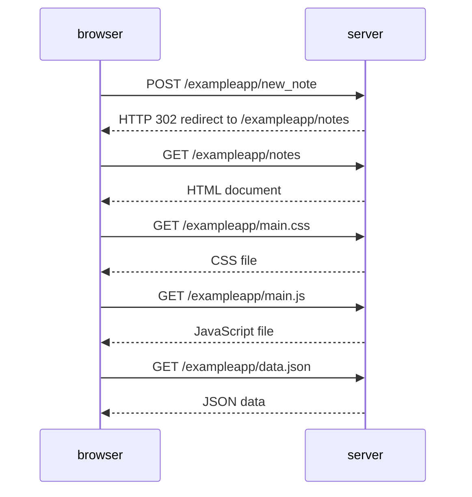

```mermaid
sequenceDiagram
    participant browser
    participant server

    browser->>server: POST /exampleapp/new_note
    server-->>browser: HTTP 302 redirect to /exampleapp/notes

    browser->>server: GET /exampleapp/notes
    server-->>browser: HTML document

    browser->>server: GET /exampleapp/main.css
    server-->>browser: CSS file

    browser->>server: GET /exampleapp/main.js
    server-->>browser: JavaScript file
    
    browser->>server: GET /exampleapp/data.json
    server-->>browser: JSON data 
```